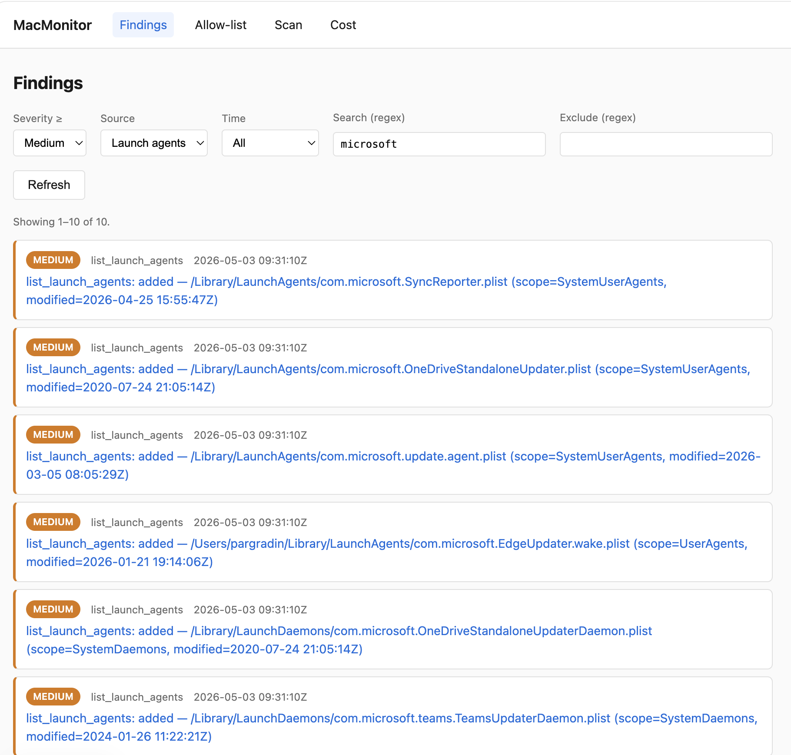

# MacMonitor

A .NET worker service that runs in the background on macOS, periodically inspects the host for malware indicators, and uses an Anthropic Claude agent with tool use to triage findings. Inspections are executed by shelling out over **SSH to localhost** rather than running commands in-process. 

See [ARCHITECTURE.md](./ARCHITECTURE.md) for the full overview.

## Requirements

- macOS 13+ (any architecture)
- .NET 10 SDK — `brew install dotnet@10` or download from <https://dotnet.microsoft.com/>
- Remote Login enabled (System Settings → General → Sharing → Remote Login)
- Full Disk Access granted to `/usr/libexec/sshd-keygen-wrapper` (see install.sh output)

## Quickstart

```bash
# 1. Generate dedicated SSH key, store in Keychain, install authorized_keys entry.
./scripts/install.sh

# 2. Set your username in appsettings.
#    Open src/MacMonitor.Worker/appsettings.json and set "Ssh": { "User": "<you>" }.
#    (install.sh prints the exact line to paste.)

# 3. Run a single scan and exit (smoke test).
dotnet run --project src/MacMonitor.Worker -- once

# 4. Run as a long-lived worker.
dotnet run --project src/MacMonitor.Worker
```

## CLI subcommands

```bash
# One-shot scan (also creates the SQLite DB on first run).
dotnet run --project src/MacMonitor.Worker -- once

# Mark an item as known-good so future scans don't alert on it.
dotnet run --project src/MacMonitor.Worker -- allow list_launch_agents \
    "/Library/LaunchAgents/com.zoom.us.plist" "Zoom auto-updater"

# Remove an allow-list entry.
dotnet run --project src/MacMonitor.Worker -- deny list_launch_agents \
    "/Library/LaunchAgents/com.zoom.us.plist"

# List the allow-list (optionally filtered by tool).
dotnet run --project src/MacMonitor.Worker -- list-allow
dotnet run --project src/MacMonitor.Worker -- list-allow list_processes

# Print the most recent N findings as JSONL (default limit 50, default min Info).
dotnet run --project src/MacMonitor.Worker -- findings 100 Medium

# Built-in help.
dotnet run --project src/MacMonitor.Worker -- help
```

## Web UI

A small Blazor Server app browses findings, manages the allow-list, and triggers scans
on demand. Loopback only — `http://127.0.0.1:5050` — no auth.




```bash
dotnet run --project src/MacMonitor.Web
# Open http://127.0.0.1:5050 in a browser.
```

Pages: **Findings** (filters by severity / source / time window, paginated), **Finding
detail** (rationale, recommended action with copy button, mark-known-good form),
**Allow-list** (add manually + per-row remove), **Scan** (run-now button + recent-scans
history), **Cost** (today vs cap, 7-day spend bar chart, recent API calls).

Live scan progress streaming is the one Phase-4 nice-to-have not yet implemented — the
manual scan button awaits the run synchronously and refreshes the history when it's
done. PHASE4.md notes it as out of scope for now.

The identity-key format is per-tool (see [PHASE2.md](./PHASE2.md)):

| Tool | Identity key |
|---|---|
| `list_processes` | `<command>@<user>` |
| `list_launch_agents` | full plist path |
| `network_connections` | `<process>\|<protocol>\|<remote-or-LISTEN:port>` |
| `recent_downloads` | full file path |

You should see something like:

```
info: MacMonitor.Worker[0] MacMonitor.Worker starting. Interval: 15 min. RunOnStartup: True.
info: ScanOrchestrator[0] Scan 0a3f… starting.
info: ListProcessesTool[0] list_processes: parsed 412 processes in 38 ms.
info: ListLaunchAgentsTool[0] list_launch_agents: parsed 187 plists in 22 ms.
info: NetworkConnectionsTool[0] network_connections: parsed 64 endpoints in 47 ms.
info: RecentDownloadsTool[0] recent_downloads: parsed 9 files in 19 ms.
info: ScanOrchestrator[0] Scan 0a3f… complete: 4 tools ran, 4 findings, 0 errors, 132 ms.
```

Tail the JSONL log:

```bash
tail -f ~/Library/Logs/MacMonitor/findings-$(date -u +%F).jsonl | jq .
```

## Project layout

```
MacMonitor/
├── ARCHITECTURE.md                 # Design doc (read this first)
├── README.md                       # You are here
├── MacMonitor.sln
├── Directory.Build.props           # Shared MSBuild settings (.net 10, nullable, warn-as-error)
├── global.json                     # Pin SDK to 10.x
├── scripts/
│   ├── install.sh                  # Keypair + Keychain + authorized_keys
│   └── uninstall.sh
└── src/
    ├── MacMonitor.Core/            # ITool, ISshExecutor, IAlertSink, IDiffer, models
    ├── MacMonitor.Ssh/             # Renci.SshNet executor, command allow-list, Keychain loader
    ├── MacMonitor.Tools/           # Four scan tools + five agent (detail) tools
    ├── MacMonitor.Storage/         # Microsoft.Data.Sqlite + handwritten DDL, IDiffer<T>s, DiffEngine, cost ledger
    ├── MacMonitor.Agent/           # Anthropic client + bounded tool-use loop
    ├── MacMonitor.Alerts/          # JSONL file sink + macOS osascript notification sink
    ├── MacMonitor.Worker/          # Host, ScanOrchestrator, CLI dispatcher
    └── MacMonitor.Web/             # Blazor Server browse / allow-list / scan UI (skeleton)
```

## Why SSH-to-localhost

Three reasons:

1. **Audit trail** — every command goes through `sshd` and shows up in `log show --predicate 'subsystem == "com.openssh.sshd"'`.
2. **Process isolation** — inspection commands run as children of sshd, not the worker. A misbehaving tool can't crash the worker.
3. **Portability** — the same code paths trivially extend to monitoring a fleet of remote Macs later by changing one config value.

The trade-off is TCC fiddliness: the binary that actually reads `~/Library` and `~/Downloads`
is `sshd-keygen-wrapper`, so that's the binary you grant Full Disk Access to. The install
script prints the exact path.

## Running as a launchd agent

Once you've smoke-tested with `dotnet run`, install as a long-lived agent. There's no
plist generator yet (coming in Phase 5); for now the architecture doc has a sketch you
can paste into `~/Library/LaunchAgents/com.you.macmonitor.plist` and load with:

```bash
launchctl bootstrap gui/$(id -u) ~/Library/LaunchAgents/com.you.macmonitor.plist
```

## Configuration

`src/MacMonitor.Worker/appsettings.json` — every setting can be overridden by an
environment variable prefixed `MACMONITOR_`, e.g. `MACMONITOR_Scan__IntervalMinutes=5`.

| Setting | Default | Notes |
|---|---|---|
| `Scan:IntervalMinutes` | 15 | How often to scan |
| `Scan:MaxScanDurationSeconds` | 60 | Hard ceiling per scan |
| `Scan:RunOnStartup` | true | Scan once on boot |
| `Ssh:Host` / `Port` / `User` | 127.0.0.1 / 22 / *(empty)* | `User` is required |
| `Ssh:KeychainItemName` | `MacMonitor.SshKey` | Must match install.sh |
| `Ssh:PrivateKeyPath` | null | Dev-only fallback if Keychain isn't set up |
| `Ssh:CommandTimeout` | 00:00:10 | Per-command timeout |
| `Alerts:LogDirectory` | `~/Library/Logs/MacMonitor` | JSONL output |
| `Alerts:MinSeverity` | `Info` | Filter for the file sink |
| `Storage:DatabasePath` | `~/Library/Application Support/MacMonitor/state.db` | SQLite state DB |
| `Storage:RetentionSnapshotsPerTool` | 5 | Latest N snapshots kept per tool |
| `Agent:Enabled` | true | Whether triage runs after diffing (Phase 3) |
| `Agent:Model` | `claude-haiku-4-5-20251001` | Anthropic model id |
| `Agent:AnthropicKeychainItem` | `MacMonitor.AnthropicKey` | Keychain item holding the API key |
| `Agent:DailyCostCapUsd` | 5.00 | Soft kill-switch — pause triage past this for the day |
| `Agent:MaxIterations` | 8 | Tool-use loop bound |
| `Notifications:Enabled` | true | macOS banner notifications |
| `Notifications:MinSeverity` | `Medium` | Findings below this severity never notify |
| `Notifications:MaxPerScan` | 5 | Caps banner spam from a single scan |
| `Notifications:IdentityCooldownHours` | 24 | Per-identity suppression window |

## Troubleshooting

**`Renci.SshNet.Common.SshException: Invalid private key file.`**
The Keychain entry isn't in the format `PrivateKeyFile` expects. This happens with
older installs that stored an Ed25519 OpenSSH-format key as plain text. Rotate:

```bash
/usr/bin/security delete-generic-password -s MacMonitor.SshKey
./scripts/install.sh
```

The current installer generates RSA-3072 in PEM format and stores it base64-encoded,
which round-trips through Keychain reliably.

**`Permission denied (publickey).` on first run.**
Either `~/.ssh/authorized_keys` doesn't have the public key (re-run install.sh), or
sshd's host key isn't in your `known_hosts` yet. Seed it once:

```bash
ssh -o StrictHostKeyChecking=accept-new $(whoami)@127.0.0.1 true
```

**`recent_downloads` returns 0 items but you have stuff in Downloads.**
Full Disk Access isn't granted. The binary that needs it is `/usr/libexec/sshd-keygen-wrapper` —
add it via System Settings → Privacy & Security → Full Disk Access (use ⌘⇧G to type the path).

## Threat model — read this

This is a userland scanner that monitors the same machine it runs on. It catches
opportunistic malware (commodity adware, persistence droppers, miners, reverse shells)
that leaves visible traces on disk or in the process table. It will *not* catch kernel
rootkits, in-memory-only payloads, or attackers who already have root and can disable
the worker. See [ARCHITECTURE.md](./ARCHITECTURE.md) for the full discussion.

## License
[MIT License](./LICENCSE.md) 

Copyright (c) 2026 Pär Gradin